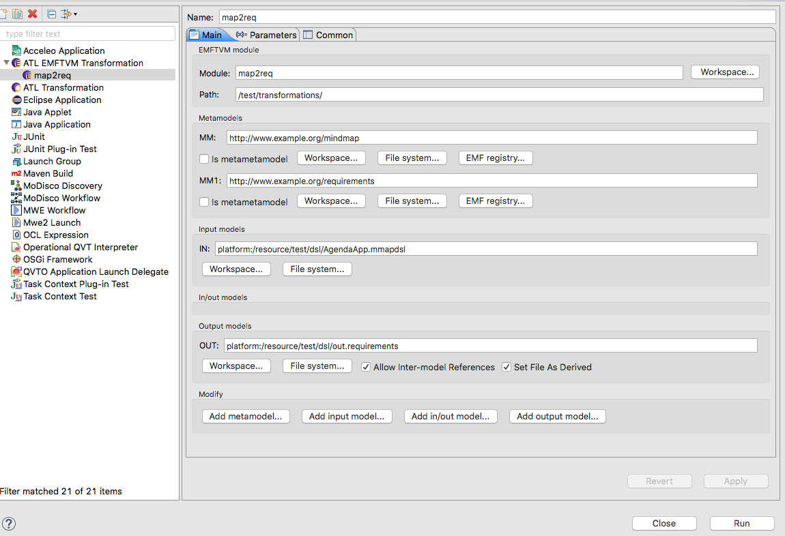

# ATL Example Project

This project uses ATL and exemplifies how to execute transformations (in-place and out-place) programmatically.

It requires that the following projects be present in the Eclipse workspace:

- [Requirements](https://bitbucket.org/mei-isep/pt.isep.edom.requirements)
- [Mindmap](https://bitbucket.org/mei-isep/pt.isep.edom.mindmap)
- [MindMap Xtext Textual DSL](https://bitbucket.org/mei-isep/pt.isep.edom.dsl.mmapdsl)  

## EMFTVM

This project uses the EMFTVM implementation of the ATL language.

see [ATL/EMFTVM](https://wiki.eclipse.org/ATL/EMFTVM#How_to_use_EMFTVM.3F)

## Maven Targets

**Notes:** 
- Before running these targets be sure to execute successfully `mvn clean install` in all the dependent projects!
- You should also run `mvn clean install`  in this project

Using **refactoring.atl**

1) To run an example of an ATL transformation that refactors a mindmap model (i.e., xmi) execute  

	mvn exec:java@refactor
	
2) To run an example of an ATL transformation that refactors a mmapdsl model (i.e., textual dsl instance) execute  

	mvn exec:java@refactorDsl

Using **map2req.atl**
	
3) To run an example of an ATL transformation that transforms Mind Maps (Textual Dsl) into Requirements (xmi) execute  

	mvn exec:java@mMapDsl2Req
	
## Notes About EMFTVM Refining Mode

ATL refining mode compiles to an in-place transformation in EMFTVM. In-place
transformations do not operate on an input model and an output model, but one
unified in/out model. This is a slight mismatch between how ATL represents the
models and how EMFTVM implements them.

In your specific case, the IN and OUT model are one and the same model. They
are mapped to an EMFTVM in/out model named IN. The OUT model does not exist in
EMFTVM. Make sure your launch configuration lists only the IN model, as an
in/out model. The in/out models can have two URIs: the left URI is the loading
URI and the right URI is the saving URI. This way, you don't end up
overwriting the input model all the time.

## Experimenting with ATL and OCL

You can experiment with ATL and OCL in a new instance of Eclipse where the plugins are activated.

Make sure all the projects listed at the beginning of this page are opened in the Eclipse Workspace. 

Spawn a new instance of Eclipse (with a Run Configuration of type "Eclipse Application").

In the second instance of Eclipse create a new java project. Add the "ATL Nature". Add also the "Xtext Nature".

Create a folder named "transformations" and copy the file "map2req.atl" from this project to the new folder.

Create a folder named "dsl" and copy the file "AgendaApp.mmapdsl" from this project to the new folder.

### ATL 

Create a "Run Configuration" similar to the one presented in the next Figure. Note that in this case the project name is "test".

You can now execute the ATL transformation that produces requirements from mind maps. 

Please refer to the document [ATL Transformations Phases](docs/atl-documentation.asciidoc) for further details on how this transformation works. 

**Note:** You should open that file inside Eclipse with the **asciidoc plugin installed** for better viewing.

### OCL

Please refer to the document [Examples of OCL Queries](docs/ocl-documentation.md) for further details on experimenting with OCL. 

 

